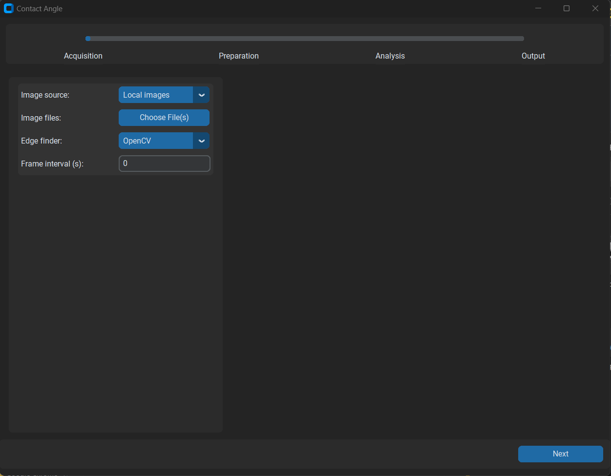
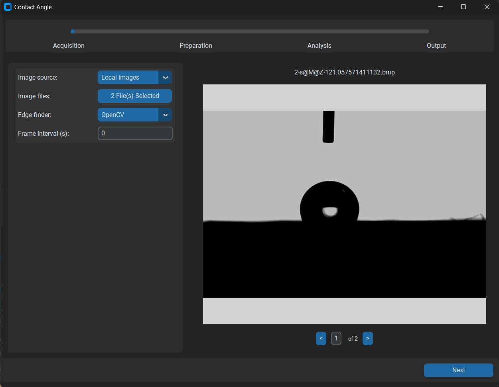

# OpenDrop-ML 

OpenDrop-ML is an open-source, cross-platform tool for analyzing liquid droplets in surface science using contact angle and pendant drop methods. It integrates classical geometric fitting with machine learning models (via Conan-ML), providing flexible, automated, and high-throughput image processing for researchers, technicians, and developers.

Current ML implementation is optimized for high angle systems. For lower angle or extreme curvature drops, verification of results is strongly advised. See: https://doi.org/10.1021/acs.langmuir.4c01050

# Table of Contents
- [OpenDrop-ML](#opendrop-ml)
- [Table of Contents](#table-of-contents)
- [Features](#features)
- [Code Structure Overview](#code-structure-overview)
- [Quick Start Guide for Windows and Linux](#quick-start-guide-for-windows-and-linux)
  - [1. Install Python](#1-install-python)
    - [Check if Python is Already Installed](#check-if-python-is-already-installed)
    - [Install Python (if not already installed)](#install-python-if-not-already-installed)
  - [2. Install C/C++ Build Tools](#2-install-cc-build-tools)
    - [Windows](#windows)
    - [Linux](#linux)
  - [3. Install Python Dependencies](#3-install-python-dependencies)
  - [4. Build Cython Extensions](#4-build-cython-extensions)
  - [5. Run the Application](#5-run-the-application)
  - [Troubleshooting](#troubleshooting)
- [Quick Start Guide for macOS (Conda Only)](#quick-start-guide-for-macos-conda-only)
  - [1. Install Conda](#1-install-conda)
  - [2. Create Conda Environment](#2-create-conda-environment)
    - [For Apple Silicon (M1/M2/M3):](#for-apple-silicon-m1m2m3)
    - [For Intel Mac:](#for-intel-mac)
  - [3. Install Python Dependencies](#3-install-python-dependencies-1)
  - [4. Build Cython Extensions](#4-build-cython-extensions-1)
  - [5. Run the Application](#5-run-the-application-1)
  - [6. VS Code or Other IDE Setup (Optional but Recommended)](#6-vs-code-or-other-ide-setup-optional-but-recommended)
- [User Guide](#user-guide)
- [Developer \& Contributor Guide](#developer--contributor-guide)
  - [Modular Design](#modular-design)
  - [Backend \& UI Extensions](#backend--ui-extensions)
- [High-Level Architecture Diagram](#high-level-architecture-diagram)
- [Unit tests](#unit-tests)
- [Appropriate use of ML model in Contact Angle Analysis](#appropriate-use-of-ml-model-in-contact-angle-analysis)
- [Contact \& Contribution](#contact--contribution)

# Features

- Contact Angle & Pendant Drop Analysis

- Multiple Fitting Algorithms: Polynomial, circular, elliptical, Young-Laplace

- Integrated ML Prediction (Conan-ML) for contact angles

- High-throughput Batch Processing of images & videos

- Cross-platform Support: Windows, macOS, Linux

- User-friendly GUI built with CustomTkinter

- Modular Backend for easy customization and extension


# Code Structure Overview

```
/ (project root)
├── main.py                  # Application entry point
├── modules/                 # Core backend logic (fitting, processing, ML)
│   ├── fits.py              # Dispatcher for fitting methods
│   ├── BA_fit.py, ellipse_fit.py, etc.
│   └── ML_model/            # TensorFlow model, input-output conversion
├── views/                   # Frontend UI (CustomTkinter)
│   ├── ca_*.py, ift_*.py    # CA/IFT workflows (acquisition → preparation → analysis → output)
│   ├── component/           # Reusable UI widgets
│   └── function_window.py   # Navigation controller
├── utils/                   # Helper code (config, validation, image IO)
├── tests/                   # Unit and integration tests
├── test_all.py              # py file to run all the unit tests
└── training files/          # ML training scripts and data
```

------

# Quick Start Guide for Windows and Linux

This guide helps you install the necessary dependencies and run the application on your local Windows and Linux machine. MacOS users please refer to [Quick Start Guide for macOS (Conda Only)](#quick-start-guide-for-macos-conda-only).

---

## 1. Install Python

### Check if Python is Already Installed
Open a terminal (Command Prompt or PowerShell) and run:
```bash
python --version
```
or:
```bash
py --version
```
If Python is installed, it will show the version.

### Install Python (if not already installed)
Download and install [Python 3.8.10](https://www.python.org/downloads/release/python-3810/), which is the recommended version for this project. Choose the installer for your operating system.

> **Windows Users:** During installation, **check the box** that says: *“Add Python to PATH”* 
> 
>  If you forget, you may need to manually add it to your **environment variables** under "System Properties > Environment Variables > Path".

> **Linux Users:** Python 3 is usually preinstalled, but you can install it via a package manager if needed:
> 
> Ubuntu/Debian: ```sudo apt install python3.8 python3.8-venv```
> 
> Fedora: ```sudo dnf install python3.8```

---

## 2. Install C/C++ Build Tools

Cython and some Python packages require C/C++ compilers to build native extensions.

### Windows

- Download and install [Microsoft C++ Build Tools](https://visualstudio.microsoft.com/visual-cpp-build-tools/)
- During installation, select:
  - "C++ build tools"
  - Include the "Windows 10 SDK" or "Windows 11 SDK"

### Linux
- For Debian/Ubuntu based systems:
  ```bash
  sudo apt update
  sudo apt install build-essential
  ```

- For Fedora/RHEL based systems:
  ```bash
  sudo dnf groupinstall "Development Tools"
  ```

- For Arch Linux:
  ```bash
  sudo pacman -S base-devel
  ```

---

## 3. Install Python Dependencies

Make sure you're in the root folder of the project, then run:

```bash
pip install -r requirements-3810.txt
```

This will install all necessary packages.

> If you’re using a virtual environment, activate it first:

On Windows
```bash
python -m venv venv
venv\Scripts\activate
```

On Linux
```bash
python -m venv venv
source venv/bin/activate
```

---

## 4. Build Cython Extensions

You’ll need to compile Cython modules before running the application:

```bash
python setup.py build_ext --inplace
```

This will generate files from the Cython sources.

> If you encounter errors, ensure:
> - Cython is installed: `pip install cython`
> - C/C++ Build Tools are properly installed (step 2)

---

## 5. Run the Application

Once the build is complete, run the main script to start the application:

```bash
python main.py
```

---

## Troubleshooting

- **Python not recognized?**
  - Make sure it’s added to `PATH` in your environment variables.

- **Cython build errors?**
  - Confirm you installed the C++ Build Tools (step 2).
  - Try `pip install --upgrade pip setuptools wheel cython`.

- **Wrong Python version?**
  - Consider using `pyenv`, `conda` (see the next section), or a virtual environment to manage Python versions.


# Quick Start Guide for macOS (Conda Only)

## 1. Install Conda

We recommend [Miniforge (Apple Silicon)](https://github.com/conda-forge/miniforge) or [Miniconda (Intel)](https://docs.conda.io/en/latest/miniconda.html).

---

## 2. Create Conda Environment

### For Apple Silicon (M1/M2/M3):

```bash
conda create -n opendrop_env python=3.8.10 numpy=1.22.4  scipy=1.7.3 pip -c conda-forge
conda activate opendrop_env
pip install tensorflow-macos==2.13.0
```

### For Intel Mac:

```bash
conda create -n opendrop_env python=3.8.10 numpy=1.22.4 scipy=1.7.3 pip -c conda-forge
conda activate opendrop_env
pip install tensorflow==2.13.0
```

---

## 3. Install Python Dependencies

Make sure you're in the root folder of the project, then run:

```bash
pip install -r requirements-3810-macos.txt
```

This will install all necessary packages.

> If you’re using a virtual environment, activate it first:

```bash
python -m venv venv
source venv/bin/activate
```
---

## 4. Build Cython Extensions

You’ll need to compile Cython modules before running the application:

```bash
python setup.py build_ext --inplace
```

This will generate files from the Cython sources.

> If you encounter errors, ensure:
> - Cython is installed: `pip install cython`

---

## 5. Run the Application

Once the build is complete, run the main script to start the application:

```bash
python main.py
```

---

## 6. VS Code or Other IDE Setup (Optional but Recommended)

If you are using VS Code or another IDE:

1. Open the Command Palette (`⇧⌘P` or `Ctrl+Shift+P`)
2. Run `Python: Select Interpreter`
3. Choose the one showing your Conda environment, such as:

   ```
   Python 3.8.10 ('opendrop_env': conda)
   ```

This ensures VS Code uses the correct environment with the right versions of `numpy`, `scipy`, `tensorflow`, etc.

---

# User Guide
After starting the application:
1. Select one of the functions: Contact Angle or Interfacial Tension

 

2. Upload Image(s)

 
 

3. Fill in user input. Note that the sample image is for contact angle, but the process is similar for interfacial tension.
   
 

4. Click 'next' to view the result!
   
 

5. Optionally save the result to a CSV file.
   
 

# Developer & Contributor Guide
## Modular Design
OpenDrop-ML emphasizes extensibility:

Add a new fitting method: See modules/fits.py

Add a UI component: See views/component/

Add a page: Update views/function_window.py

## Backend & UI Extensions
Refer to:

“Add Backend Module Steps – Guide to adding new models”

“Add Frontend Module Steps – UI integration tutorial”


# High-Level Architecture Diagram


# Unit tests
See [TESTING.md](./TESTING.md) for more details on how to run the built-in unit tests.

# Appropriate use of ML model in Contact Angle Analysis

The key limitation of ML models is that accuracy may deteriorate when used
on systems which was not represented within it's training data. While it has
been shown that the model can be applied to systems of contact angles below
110°, caution should be applied applied in these cases. It is recommended that
contact angles are plotted and briefly examined (i.e. sense-checked) as
general practice, but particularly for systems outside of training domain.
Similarly, drops with Bond numbers greater than 2 were not included in the
training set and should be approached with caution.

Surface roughness and reflection were included to train the model to ignore
inputted data which is not the drop edge. However, few images with surface
roughness which deviated from the training data were included in the
experimental data set. As such users are again advised to check outputs
for systems outside of the training range.

As the resolution of an image can be altered, should the resolution of an
image be too high it will be lowered to give an input suitable for the
ML model. This is the only exception to the above limitations.

High quality edge detection should be used to achieve the best results.
This work presents an automated process, which still requires improvement,
but will likely be suitable for high contrast images. Users are recommended
to check that the detected edge is reasonable prior to accepting the results
outputted by any fitting or angle prediction approach.

Current OpenDrop-ML implementation performs best for contact angles above 110°. For low-angle or high-curvature drops, verification is advised. See: [https://doi.org/10.1021/acs.langmuir.4c01050](https://doi.org/10.1021/acs.langmuir.4c01050)

Users should validate predictions manually in cases:
* With extreme Bond numbers (>2)
* With strong surface roughness/reflections
* Outside of the model's trained contact angle range

# Contact & Contribution

OpenDrop-ML is an open-source project. Contributions are welcome!

- GitHub: https://github.com/SamSike/OpenDrop_OP
- For issues, use GitHub issue tracker